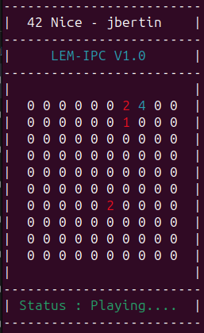
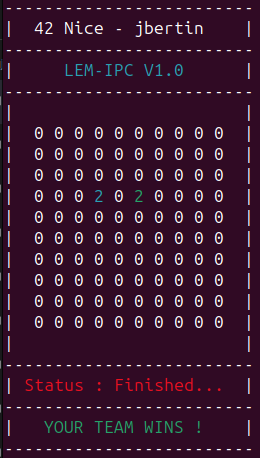
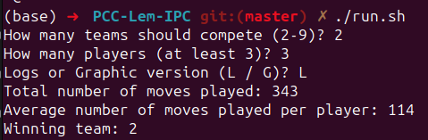

# Lem-IPC

Lem-IPC is an automated game where bots, grouped into teams, strategically position themselves on a 2D board. The primary objective is for a team to outlast the others and claim the board. Bots are eliminated when surrounded by members of another team. The game's climax is reached when only one team remains on the battlefield.

**Developed and tested on a Linux Ubuntu 23.04.**

----


*Playing*


*End game - Graphical*


*End game - Log mode*

## Features
- Automated Gameplay: Bots make decisions and play automatically, offering a spectator-style experience.
- Battle Ground: A 2D board forms the arena where bots employ their strategies.
- IPC Mechanics: Uses shared memory segments (SHM), semaphores, and message queues (MSGQ) for inter-process communication between bots.
- Visualization: Witness the action in both text and graphic modes.
- Custom Library: Integrated a custom libft library for core functionalities.

----

## Build and Installation

Clone the repository:

``git clone https://github.com/jmbertin/Lem-IPC/``

Navigate to the project directory and compile using Makefile:

``cd Lem-IPC``

``make``

----

## Usage

Launch the game by executing the lemipc binary :
``./lemipc [team_number 1-9]``

You have to choose a team in the first argument.

Utilize the provided SH script for easy simulation configuration and initiation.
``./run.sh``

````
How many teams should compete (2-9)?
How many players (at least 3)?
Logs or Graphic version (L / G)?
````


**For a better experience, it is recommended to open several terminals and launch the program as many times as there are players. Indeed, the superposition of multiple processes with redirection in the same window can cause problems.**

----

## Contribution
If you encounter any bugs or wish to add features, please feel free to open an issue or submit a pull request.
